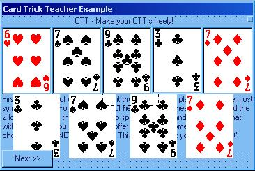



## Card Trick Teacher \(Example\)

### Description

Well am starting a program... I want you to follow my example and make lots of card tricks for everyone to learn. This is a simple [but effective] trick that everybody can do. I explain how. I also included a famous pc card trick...
 
### More Info
 

             |
---                |---
**Submitted On**   |2002-08-30 11:24:04
**By**             |[IcEbOy16](https://github.com/Planet-Source-Code/PSCIndex/blob/master/ByAuthor/iceboy16.md)
**Level**          |Beginner
**User Rating**    |3.0 (9 globes from 3 users)
**Compatibility**  |VB 5\.0, VB 6\.0
**Category**       |[Games](https://github.com/Planet-Source-Code/PSCIndex/blob/master/ByCategory/games__1-38.md)
**World**          |[Visual Basic](https://github.com/Planet-Source-Code/PSCIndex/blob/master/ByWorld/visual-basic.md)
**Archive File**   |[Card\_Trick1245488302002\.zip](https://github.com/Planet-Source-Code/iceboy16-card-trick-teacher-example__1-38496/archive/master.zip)

